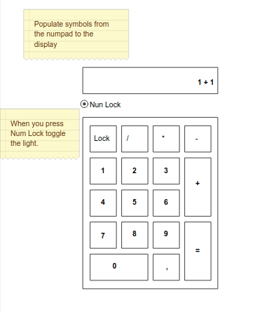

# Numpad



Your task is to implement a numpad with a display and a Num Lock toggle.

The [CSS Grid](https://css-tricks.com/snippets/css/complete-guide-grid/) will be really handy here.

Try splitting your code into different components. ```<Numpad>```, ```<Button>```, ```<Display>```

## Advanced Task

There are different layouts of [numpads](https://www.google.bg/search?biw=1093&bih=513&tbm=isch&sa=1&ei=R-XRW4rQE4uRrgS5poHoDA&q=numpad&oq=numpad&gs_l=img.3..0i67k1j0l9.7466.7466.0.7683.1.1.0.0.0.0.108.108.0j1.1.0....0...1c.1.64.img..0.1.107....0.eQVdVPF8Roo).

Try loading the layout from data.json. Keys can be with double width or double height.

The [classnames](https://github.com/JedWatson/classnames) lib can be handy here.
