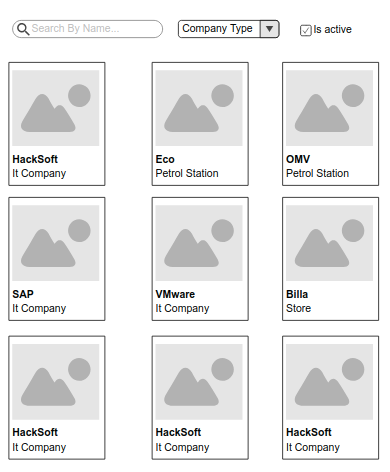

# Filters

Your task is to implement the nightmare for every web developer. Single Page Filters!

Here is a backend prepared for you: https://my-json-server.typicode.com/HackSoftware/companies.db

Here is how we make http requests in JS https://developer.mozilla.org/en-US/docs/Web/API/Request
