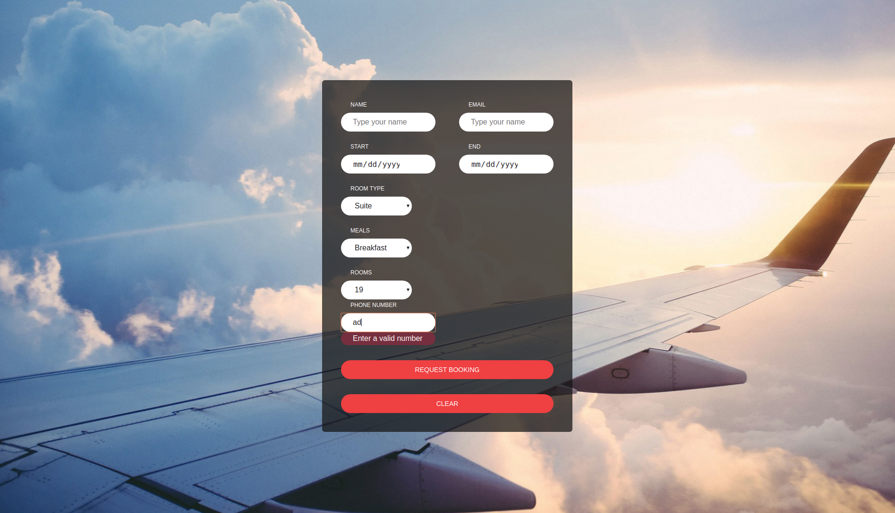
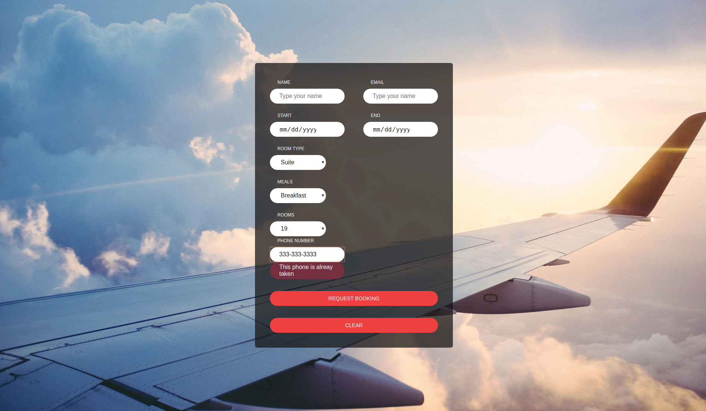

# Form Validations

Having learned how to submit forms and handle submit errors in the previous lesson, we will now learn how to work with async & sync validations with local state forms. Here are some examples:






## Tasks

1) When typing in the `name` field, prefill the `email` field if there is an email, correspoing to the name written.
Validate the name is no more than 20 characters long.

2) Create a room field. When rendering the form for the first time, load only the room options for the first fetched room type. When changing a room type, in the room field load only the available rooms per the selected room type.


## Additional endpoints to use:

1) https://react-forms-backend.herokuapp.com/booking/email-exist-per-name/
  post api to check wether an email exists per name - returns an email per a given name, expects the following data:
  ```
  {
    name: some-name-here
  }
  ```
  returns a name in the folling format:
  ```
    email: some-email-here
  ```

  If no email exists by the given name, the api returns successfull status 200 Ok.

2) https://react-forms-backend.herokuapp.com/booking/available-rooms/<room_type>/ , where <room_type> is an id of a certain room type
 get api to fetch the available rooms per room type, returns the data in the following format:
 ```
 [
    {
        "id": 7,
        "name": "7",
        "room_type": "Suite",
        "available": true
    },
    {
        "id": 1,
        "name": "1",
        "room_type": "Suite",
        "available": true
    }
]
 ```
